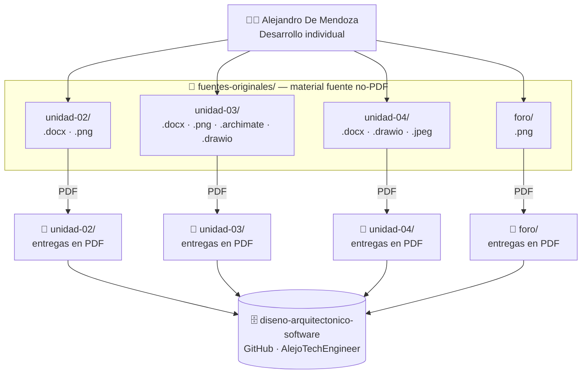

<div align="center">

# 🏗️ Diseño Arquitectónico de Software

### Actividades · Laboratorios · Entregas — Unidades 2 · 3 · 4

[](https://www.opengroup.org/archimate-forum)
[](https://www.archimatetool.com/)
[](https://c4model.com/)
[](https://www.drawio.com/)
[](https://www.microsoft.com/microsoft-365/word)
[](.)

*Repositorio maestro del módulo Diseño Arquitectónico de Software · Maestría en Arquitectura de Software · Politécnico Grancolombiano*

</div>

---

## ¿Qué es esto?

Repositorio consolidado con todas las actividades, laboratorios y entregas del módulo **Diseño Arquitectónico de Software**, correspondiente a la Maestría en Arquitectura de Software del Politécnico Grancolombiano.

Organiza en un único lugar las tres unidades trabajadas durante el módulo: identificación de atributos de calidad (Unidad 2), modelado de arquitectura con C4 y ArchiMate sobre el caso TradeNova (Unidad 3), y diseño de decisiones arquitectónicas con el método ADD sobre SmartRoad (Unidad 4).

---

## Arquitectura



---

## Estructura

```
diseno-arquitectonico-software/
│
├── README.md                                                          # Este archivo
├── .gitignore
│
├── unidad-02/                                                         # Lab No. 1 — Atributos de Calidad
│   ├── README.md
│   ├── Desarrollo_Indentificacion_Atributos_Calidad.pdf               # Entrega individual
│   └── Desarrollo_Indentificacion_Atributos_Calidad_grupo_mad_7.pdf   # Entrega grupal (MAD-7)
│
├── unidad-03/                                                         # Lab No. 2 — Modelo C4 TradeNova
│   ├── README.md                                                      # Documentación del modelo C4
│   ├── ActividadFormativa_U3.pdf
│   ├── Desarrollo_U3_DisenoArqSoft_Final_Alejandro_De_Mendoza.pdf
│   └── TradeNova_Informe_C4_Completo.pdf
│
├── unidad-04/                                                         # Lab No. 3 — ADD SmartRoad
│   ├── README.md
│   ├── ActividadSumativa_U4.pdf
│   ├── ADD_SmartRoad_U4.pdf                                           # Architecture Decision Document
│   ├── LF_U4.pdf
│   └── Unidad3_C4_TradeNova-copia-apa.pdf
│
├── foro/                                                              # Actividad de foro
│   └── Infografia de Alejandro De Mendoza.pdf
│
└── fuentes-originales/                                                # Material fuente no-PDF
    ├── unidad-02/
    │   ├── Desarrollo_Indentificacion_Atributos_Calidad.docx
    │   ├── Desarrollo_Indentificacion_Atributos_Calidad_grupo_mad_7.docx
    │   ├── 1.png
    │   └── Comprobante de entrega de la atividad desarrollada.png
    ├── unidad-03/
    │   ├── TradeNova_C4.archimate                                     # Modelo ArchiMate (fuente)
    │   ├── ActividadFormativa_U3.docx
    │   ├── Desarrollo_U3_DisenoArqSoft_Final_Alejandro_De_Mendoza.docx
    │   ├── TradeNova_Informe_C4_Completo.docx
    │   └── 01-04 · Diagramas C4 .png
    ├── unidad-04/
    │   ├── ADD_SmartRoad_U4.docx
    │   ├── ActividadSumativa_U4.docx
    │   ├── LF_U4.docx
    │   ├── Unidad3_C4_TradeNova-copia-apa.docx
    │   ├── c4-model-tradenova.drawio
    │   └── Imagen soporte entrega.jpeg
    └── foro/
        └── Infografia de Alejandro De Mendoza.png
```

---

## Resumen por unidad

| Unidad | Tema | Tipo de entrega | Estado |
|--------|------|-----------------|--------|
| **Unidad 2** | Identificación de Atributos de Calidad | Documento Word + PDF (individual y grupal MAD-7) | ✅ Entregado |
| **Unidad 3** | Modelado C4 — TradeNova (plataforma de trading) | Modelo ArchiMate · Informe · Diagramas C4 exportados | ✅ Entregado |
| **Unidad 4** | Architecture Decision Document (ADD) — SmartRoad | Documento ADD · Lineamiento formal · Draw.io | ✅ Entregado |
| **Foro** | Infografía de arquitectura de software | PDF + PNG | ✅ Entregado |

---

## Herramientas

| Herramienta | Versión | Propósito |
|-------------|---------|-----------|
| **[Archi](https://www.archimatetool.com/)** | 5.9.0 | Modelado ArchiMate y exportación de diagramas C4 |
| **ArchiMate** | 3.1 | Lenguaje de modelado de arquitectura empresarial (Open Group) |
| **C4 Model** | — | Framework de comunicación de arquitectura (Simon Brown) |
| **[Draw.io](https://www.drawio.com/)** | — | Diagramas de arquitectura vectoriales |
| **Microsoft Word** | — | Redacción de informes, documentos técnicos y entregas |

---

## Autor

**Alejandro De Mendoza**  
Ingeniero Informático · Especialista en IA · Maestría en Arquitectura de Software  
[@AlejoTechEngineer](https://github.com/AlejoTechEngineer)
